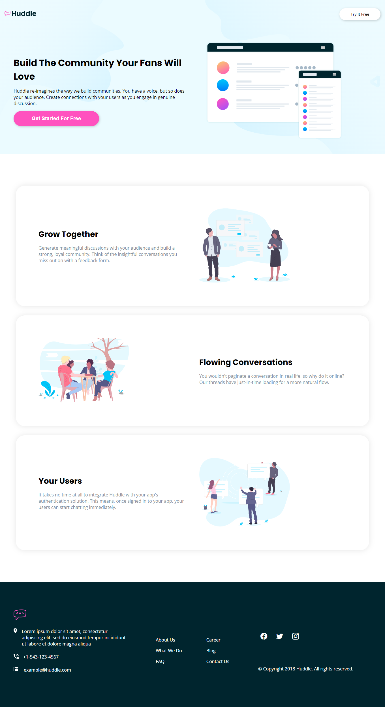

# Solution for the Huddle Landing Page

This is a solution for the Huddle landing page challenge from Frontend Mentor.

- [Solution for the Huddle Landing Page](#solution-for-the-huddle-landing-page)
  - [Preview](#preview)
    - [Mobile preview](#mobile-preview)
    - [Desktop preview](#desktop-preview)
  - [Tools and Techniques](#tools-and-techniques)
  - [URLS](#urls)

## Preview

### Mobile preview

### Desktop preview

> [!NOTE]
> This screenshot was taken before I pushed the branch in which the `footer__popup` was created.

## Tools and Techniques

- HTML
- CSS
- `grid`, `flex` and `@media`
- Mobile-first development
- [Visual Studio Code](https://code.visualstudio.com)
- Brave Web Browser (based on Chrome)

## URLS

- GitHub repository URL: [Go to repository >](https://github.com/Code-Beaker/huddle-website-frontend-mentor)
- Vercel Deployment: [Visit >](https://huddle-website-frontend-mentor.vercel.app/)
